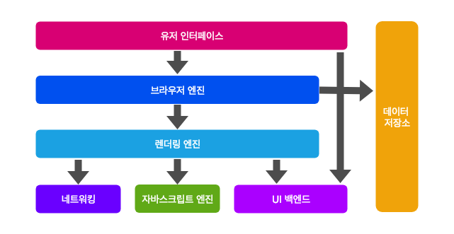
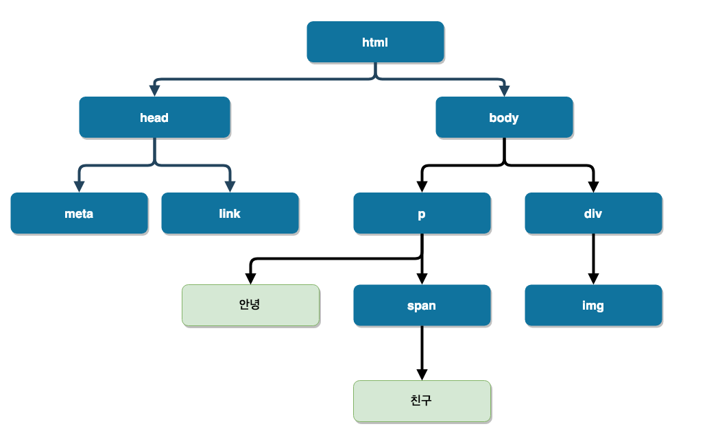
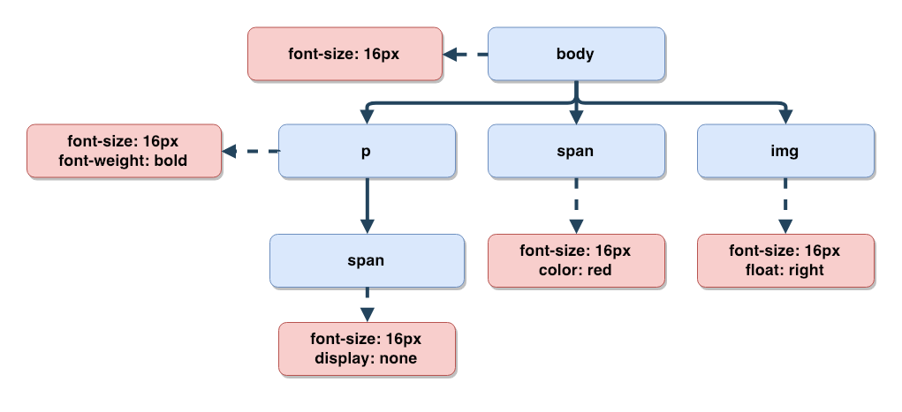
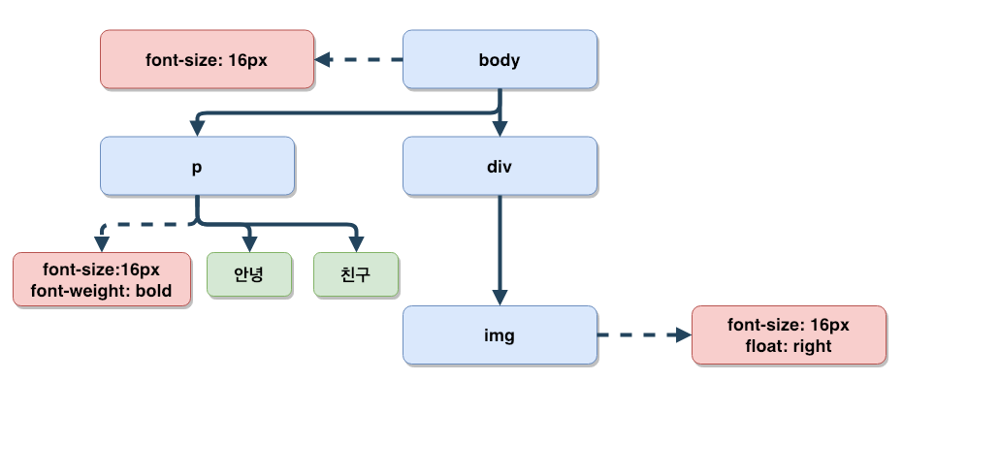
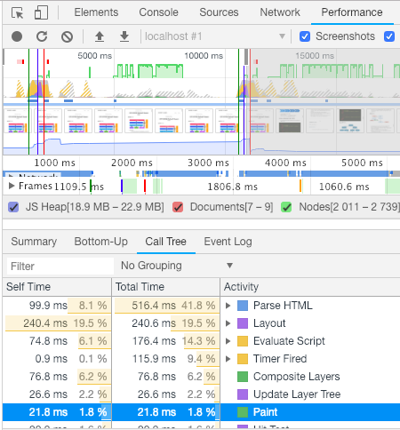

## 브라우저 구조


* **유저 인터페이스** 
  - 주소 표시줄, 뒤로가기/앞으로가기 버튼, 북마크 메뉴 등 브라우저의 사용자 UI. 요청한 페이지를 보여주는 랜더링 페이지를 제외한 나머지 모든 부분입니다.
* **브라우저 엔진** 
  - 유저 인터페이스와 렌더링 엔진 사이의 동작을 제어합니다.
* **렌더링 엔진** 
  - 요청한 웹페이지의 콘텐츠를 표시합니다. HTML과 CSS를 파싱하여 화면에 표시합니다.
* **네트워킹** 
  - XHR(http, file, ftp 등) 요청과 같은 네트워크 호출에 사용됩니다. 플랫폼 독립적인 인터페이스이고 각 플랫폼 하부에서 실행됨.
* **자바스크립트 엔진** 
  - 자바스크립트 코드를 해석하고 실행 
* **UI 백엔드** 
  - 콤보 박스, 체크박스 및 윈도우와 같은 핵심 위젯을 그린다. 
플랫폼에서 명시하지 않은 일반적인 인터페이스로서, OS 사용자 인터페이스 체계를 사용합니다.
* **데이터 저장소** 
  - 웹에서 데이터를 하드디스크에 저장합니다. 저장소는 
localStorage, SessionStorage,ndexed Database, 쿠키같은 플랫폼 별로 지원되는 저장소를 제공합니다.
    
## Reflow와 Repaint은 렌더링 엔진에서 일어난다
* 렌더링 엔진의 주요 역할은 브라우저 화면에 요청된 페이지를 표시하는 것입니다. 렌더링 엔진은 HTML 및 XML 문서와 이미지들을 표시할 수 있습니다. 물론 브라우저의 추가적인 플러그인을 사용한다면, PDF와 같이 다른 문서도 표시할 수 있습니다.

## 렌더링 엔진
* Gecko - 파이어폭스
* Webkit - 크롬, 사파리
* EdgeHTML - 엣지 **(Chromium 변경 예정)**
* ~~Trident - 익스플로어 **(싫다)**~~ 

## 렌더링 과정


* HTML을 파싱해 DOM 트리를 구성한다.
* 렌더 트리를 구성한다.
* 렌더 트리를 레이아웃한다. - **Gecko엔진에선 Reflow로 표현**
* 렌더 트리를 그린다. - **Gecko엔진에선 Repaint로 표현**

## HTML을 파싱해 DOM 트리를 구성한다.
* HTML 도큐먼트를 파싱하고 파싱된 요소들을 DOM 트리의 실제 DOM 노드로 변환하는 것이다.

```html
<html>
  <head>
    <meta charset="UTF-8">
    <link rel="stylesheet" type="text/css" href="app.css">
  </head>
  <body>
    <p>
        안녕
        <span>친구</span>
    </p>
    <div> 
      
    </div>
  </body>
</html>
```
## Dom 트리 구조


* 기본적으로 각 요소는 모든 요소에 대한 부모 노드로 표시되며, 이 관계들은 DOM 트리에 포함된다. 그리고 이것은 노드마다 재귀적으로 적용된다.

## CSSOM 트리 구성

```css
body { 
  font-size: 16px;
}

p { 
  font-weight: bold; 
}

span { 
  color: red; 
}

p span { 
  display: none; 
}

img { 
  float: right; 
}
```
* CSSOM는 CSS 객체 모델(CSS Object Model)을 말한다. 브라우저가 페이지 내 DOM을 구성하는 동안, head 영역에서 외부 CSS 스타일 시트 theme.css 를 참조하는 link 태그를 만난다. 페이지를 그리기 위해 해당 파일이 필요한 것을 예상하면서 즉시 자원 요청을 한다.

## CSSOM 트리 구조


* 페이지 상에서 어떤 객체에 대한 최종 스타일 묶음이 계산될 때, 브라우저는 해당 노드에 적용할 수 있는 가장 일반적인 규칙으로 시작한다. 예를 들어, body 엘리먼트의 자식인 경우 body의 모든 스타일이 적용된다. 그리고 특정 규칙을 적용해 재귀적으로 계산된 스타일들을 구체화한다.

* body 엘리먼트 안에 있는 span 태그의 텍스트는 폰트 크기가 16 픽셀이면서 빨간색이다. 이 스타일들은 body 엘리먼트로부터 상속된다. 만약 span 엘리먼트가 p 엘리먼트의 자식이라면, 해당 엘리먼트에 적용된 특정 스타일 때문에 내용이 보이지 않는다.

* 위의 트리는 완전한 CSSOM 트리가 아니며 우리가 추가한 스타일 시트에서 재정의된 스타일들만 보여준다. 모든 브라우저는 "사용자 에이전트 스타일(user agent styles)" 인 기본 스타일 묶음을 제공한다. 이것은 우리가 명시적으로 스타일을 지정하지 않을 때 적용되는 스타일이다. 우리가 지정한 스타일은 이 기본 스타일을 덮어쓴다.


## 랜더링 트리


* 렌더링 트리를 생성하려면 브라우저가 대략적으로 다음 작업을 수행합니다.
* DOM 트리의 루트에서 시작하여 표시되는 노드 각각을 연결합니다.
* 일부 노드는 표시되지 않으며(예: 스크립트 태그, 메타 태그 등), 렌더링된 출력에 반영되지 않으므로 생략됩니다.
* 일부 노드는 CSS를 통해 숨겨지며 렌더링 트리에서도 생략됩니다. 
* 예를 들어,span 노드의 경우 'display: none' 속성을 설정하는 명시적 규칙이 있기 때문에 렌더링 트리에서 누락됩니다.
* 표시된 각 노드에 대해 적절하게 일치하는 CSSOM 규칙을 찾아 적용합니다.
* 표시된 노드를 콘텐츠 및 계산된 스타일과 함께 내보냅니다.
  - 참고: visibility: hidden은 display: none과 다릅니다. 전자는 요소를 보이지 않게 만들지만, 이 요소는 여전히 레이아웃에서 공간을 차지합니다(즉, 비어 있는 상자로 렌더링됨). 반면, 후자(display: none)는 요소가 보이지 않으며 레이아웃에 포함되지도 않도록 렌더링 트리에서 요소를 완전히 제거합니다.

* 최종 출력은 화면에 표시되는 모든 노드의 콘텐츠 및 스타일 정보를 모두 포함하는 렌더링 트리입니다. 렌더링 트리가 생성되었으므로 '레이아웃' 단계로 진행할 수 있습니다.

## 렌더 트리 레이아웃

* 렌더러가 생성되고 트리에 추가될 때, 이 렌더러는 위치와 크기를 가지지 않는다. 이러한 값들을 계산하는 것을 레이아웃이라고 부른다.
* HTML은 흐름-기반(flow-based) 레이아웃 모델이다. 이것은 대부분 단일 방향에서 기하학적 값들을 계산할 수 있음을 의미한다. 좌표계는 루트 렌더러를 기준으로 한다. top, left 좌표가 사용된다.
* 레이아웃은 재귀적인 과정이다. 이것은 루트 렌더러(HTML 도큐먼트 엘리먼트에서 <html>에 해당)에서 시작된다. 레이아웃은 부분 또는 전체 렌더러의 계층을 통과하면서 재귀적으로 반복되고, 이를 필요로 하는 렌더러의 기하학적 정보를 계산한다.
* 루트 렌더러의 위치는 0,0이고 치수는 브라우저 윈도우에서 보이는 부분의 크기(뷰포트)이다.
* 레이아웃 시작은 각 노드에 화면에 표시되어야 하는 정확한 좌표를 전달하는 것을 의미한다.

### 리플로우 발생 요소
* 노드의 추가 또는 제거
* 요소의 위치 변경
* 요소의 크기 변경 (margin, padding, border, width, height...)
* 폰트 변경과(텍스트 내용) 이미지 크기 변경 (크기가 다른 이미지로 변경 시)
* 페이지 초기 랜더링최초 Layout 과정)
* 윈도우 리사이징

## 렌더 트리 페인팅
* 렌더 트리를 순회하고 화면상에 콘텐츠를 보여주기 위해 렌더러의 paint() 메서드를 호출해본다.
* 페인팅은 global이거나 incremental(레이아웃과 유사하다)일 수 있다.
* Global - 전체 트리가 다시 그려진다.
* Incremental - 전체 트리에 영향을 주지 않는 방법으로 렌더러 일부가 변경된다. 렌더러는 화면상에서 렌더러의 사각형을 무효로 한다. 이렇게 하면 운영 체제(OS)가 다시 그리기 필요한 영역으로 인식하고 paint 이벤트를 발생시킨다. OS는 몇몇 영역을 하나로 병합하여 똑똑한 방식으로 이를 처리한다.
페인트가 점진적인 과정임을 이해하는 것이 중요하다. 더 나은 UX의 경우, 렌더링 엔진은 가능한 한 빠르게 화면상에 콘텐츠를 보여줄 수 있도록 시도할 것이다. 이 렌더링 엔진은 렌더 트리를 만들고 레이아웃하기 위해 모든 HTML이 파싱될 때까지 기다리지 않는다. 콘텐츠 일부는 파싱되고 표시되며, 나머지 콘텐츠 항목들을 네트워크상에서 계속 처리된다.

## 크롬 개발자 도구를 통해 랜더 과정 확인


## Google의 리플로우를 최소화하는 데 도움이 되는 간단한 가이드라인
* 불필요한 DOM 트리 깊이를 줄입니다. DOM 트리의 하위 노드를 변경하면 트리의 모든 수준, 즉 위로는 루트, 아래로는 수정된 노드의 하위 요소에 이르기까지 모두 변경될 수 있습니다. 이에 따라 리플로우를 실행하는 데 더 많은 시간이 걸리게 됩니다.
* CSS 규칙을 최소화하고 사용되지 않는 CSS 규칙을 삭제합니다.
* 애니메이션과 같이 복잡한 렌더링을 변경하는 경우 흐름 밖에서 변경합니다. 변경할 때는 절대 위치나 고정 위치를 사용합니다.
* 불필요하고 복잡한 CSS 선택기, 특히 하위 요소 선택기는 사용하지 않습니다. 이 경우 선택기를 일치시키기 위해 더 높은 CPU 처리량이 필요합니다.

### _**기억해두고 나중에 잊지말고 최적화 이슈에 적용하자**_