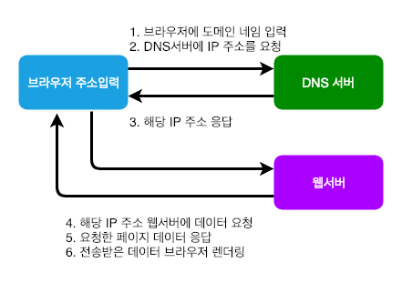

## 사용자들이 브라우저에 주소를 입력하면 어떻게 화면에 웹사이트가 표시되는 것일까?

1. **브라우저에 도메인이 입력**
    - 브라우저는 도메인이 캐시에 들어있는지 확인합니다.
        `chrome://net-internals/#dns`
    - OS DNS Cache
    - 만약 Browser Cache에서 못 찾으면, OS에 저장된 DNS Cache를 찾게 됩니다.
    - 각 OS의 hosts 위치 : Link
        * `Mac : /etc/hosts`
        * `Window: ipconfig /flushdns 커멘드 입력`
    - 만약 OS Cache에서도 못 찾으면, Router DNS Server에 직접 조회를 진행하게 됩니다.
    현재 접속한 NameServer 주소

2. **DNS서버에 IP 주소를 요청**
    - Router DNS Server에 조회해서 없다면, Root DNS부터 조회를 하여 결과를 가져옵니다.

3. **수신한 IP주소에 해당하는 웹서버에 접속**
    - Http Request를 위해, TCP Socket을 개방하고, 연결한다. 이 과정에서 3-Hand-Shaking이 일어난다. TCP 연결에 성공하면, Http Request가 TCP Socket을 통해 보내진다. 이에 대한 응답으로, 웹 페이지의 정보가 사용자의 PC로 들어온다.
        * `3HAND Shaking (TCP Socket 연결을 하여, 데이터를 전송하기 위해서 발생한다)`
            1. 접속 요청 프로세스가 연결요청 메시지 전송(SYN)
            2. 접속 요청을 받은 프로세스가 수락 (SYN + ACK)
            3. 마지막으로 접속 요청 프로세스가 수락 확인을 보내 연결을 맺음(ACK)
                - SYN(Synchronization) : 연결요청, 세션을 설정하는데 사용되며 초기에 시퀀스 번호를 보냄
                - ACK(Acknowledgement) : 보낸 시퀀스 번호에 TCP 계층에서의 길이 또는 양을 더한 것과 같은 값을 ACK에 포함하여 전송

        * `4 Way (Four Way) Handshake (연결 종료)`
            1. 클라이언트가 연결을 종료하겠다는 FIN 플래그를 전송한다.
            2. 서버는 일단 확인메시지를 보내고 자신의 통신이 끝날때까지 기다리는데 이 상태가 TIME_WAT 상태
            3. 서버가 통신이 끝났으면 연결이 종료되었다고 클라이언트에게 FIN 플래그를 전송
            4. 클라이언트는 확인했다는 메시지를 보냄
                - FIN(Finish) : 세션을 종료시키는데 사용되며 더 이상 보낸 데이터가 없음을 표시

4. **브라우저 페이지 렌더링**