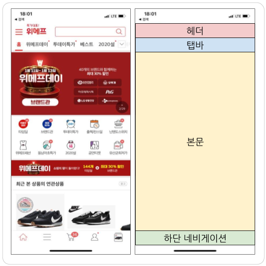
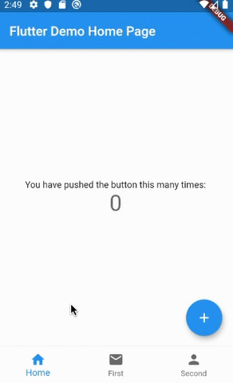
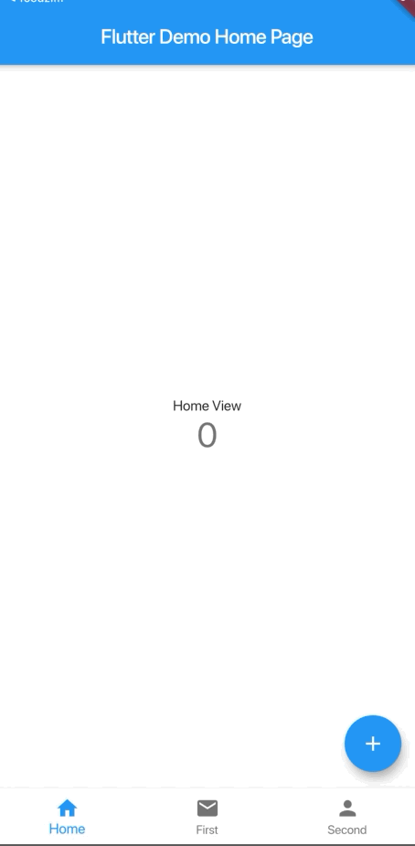

페이지 전환 시에 이전 페이지 상태를 남기기 위한 기능을 구현하기 위해 찾아봤습니다.



보통 서비스 앱구조를 살펴보면 하단 네비게이션, 상단 탭 구조 + 하단 네비게이션 구조를 대부분 사용합니다.  하단 네비게이션 전환시나 상단 탭 전환시 불필요한 데이터 요청을 하지 않고 ui 상태값을 캐싱해 화면 구성을 위한 위젯을 살펴보았습니다. 그 결과 탭을 변경하면서 그전 페이지 상태를 유지하는 방법을 적용해 보겠습니다.

# 1. 이전 코드를 clone 받습니다.
```
git clone https://github.com/yoonjaepark/flutter_keep_alive_skeleton/tree/bottomNavigationBar
```
# 2. 현재 구조



현재 앱 구조

현재 탭은 3개로 나눠져 있지만 Home 탭을 보면 아시겠지만 페이지별 state값이 저장되지 않아 매번 새로운 값을 노출되게 됩니다. 이는 사용자에게 있어서 앱의 사용 경험에 있어서 안좋은 경험을 하게 해줍니다. 예를 들어 home탭에서 스크롤을 한참 내려서 게시글을 보던중 first탭에 갔다 다시 왔을때 페이지를 다시 처음부터 다시 내려야되는 불하는 편함을 경험시키기게 되기 때문에 페이지별 상태값을 유지시키는 방법을 찾아 보았고 그중 AutomaticKeepAliveClientMixin 를 적용 시켜 보려고 합니다. 

# 2. 페이지별 상태값 유지시키기

페이지별 상태값을 유지시키는것은 여러가지 방법이 있을 수 있습니다. 제가 찾아본 방법보다 더 간단하고 좋을 방법이 있을지 모르겠지만 현재 제가 알아본 방법으로는 몇몇 방법이 있고 그중 제가 제일 간단하다고 느낀 AutomaticKeepAliveClientMixin + PageView 를 적용시켜 보겠습니다. 

- ***main.dart***

기존 body를 PageView로 래핑해서 BottomNavigationBar + PageView 구조로 변경해 페이지 인스턴스가 삭제되지 않게 해줍니다.
``` dart
    class _MyHomePageState extends State<MyHomePage> {
      int _currentIndex = 0;
    
      final List<Widget> _children = [Home(), First(), Second()];
    
      void _onTap(int index) {
        pageController.jumpToPage(index);
      }
    
      void onPageChanged(int index) {
        setState(() {
          _currentIndex = index;
        });
      }
    
      final pageController = PageController();
    
      @override
      Widget build(BuildContext context) {
        return Scaffold(
            appBar: AppBar(
              title: Text(widget.title),
            ),
            body: PageView(
              controller: pageController,
              onPageChanged: onPageChanged,
              children: _children,
              physics: NeverScrollableScrollPhysics(), // No sliding
            ),
    			...
        );
      }
    }
```

상태값 유지시키고싶은 페이지에 mixin 추가하고 wantKeepAlive 값을 true로 설정해줍니다.
``` dart
    class _HomeState extends State<Home> 
    with AutomaticKeepAliveClientMixin {
      int _counter = 0;
    
      @override
      bool get wantKeepAlive => true;
```



# 마무리
이번 글에선 AutomaticKeepAliveClientMixin 를 이용해 화면의 상태값을 유지 시키게 변경 시켜보았습니다. 프로젝트에서 사용된 코드는 [Github](https://github.com/yoonjaepark/flutter_keep_alive_skeleton/tree/keepAlive) 에서 열람 가능합니다.